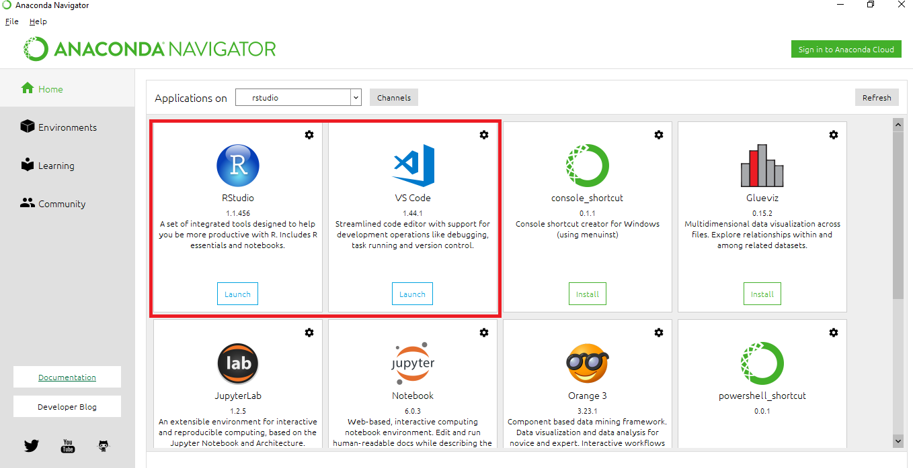
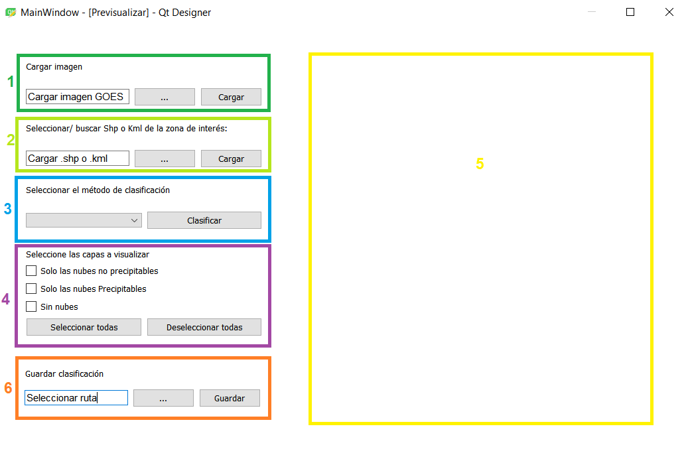
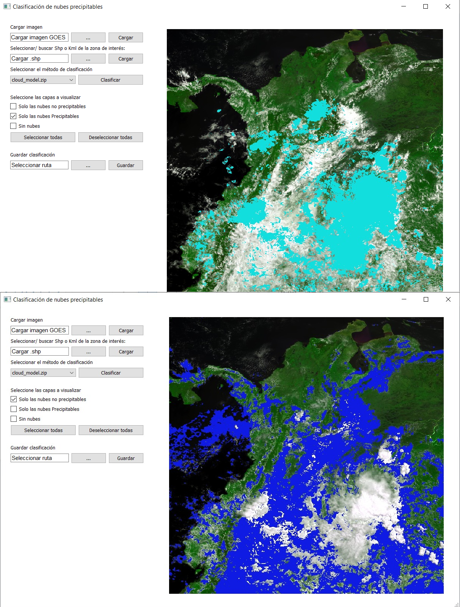

# Precipitation_cloud
Classification of precipitable clouds from machine learning random forest, svm, multilayer perceptron.

## 1. Dependencies
  - [Python v3.7](https://www.anaconda.com/distribution/)
  - [R](https://rstudio.com/products/rstudio/download/) 
## 2. Install

### from Anaconda

  - Install Anaconda (https://www.anaconda.com/distribution/) distribution python 3.7 version, grant environment variable permissions(No pycharm).
  - Open Anaconda Navigator, install RStudio,Vs Code.
  - In Vs Code install python `3.7`.
  
  - Create environment variable `R_LIBS_USER` direction `path_to\Anaconda3\envs\rstudio\lib\R\library`.
  - Install packages python from cmd: netcdf4, tensorflow,sklearn, talos, rpy2,Gdal.
  - From Rstudio install raster, rasterVis, sp, rgdal, glcm.
  

### Independent  
- Install python3.7.
- Install R-Studio.
- Install package [rpy2](https://www.lfd.uci.edu/~gohlke/pythonlibs/#rpy2) in python.
- Create environment variable `R_LIBS_USER` direction `path_to\Anaconda3\envs\rstudio\lib\R\library`.
- Install [GDAL](http://www.gisinternals.com/release.php) in python:
  - Edit the environment variable `PATH`, add `GDAL = C:\ProgramData\Microsoft\Windows\Start Menu\Programs\GDAL`. 
  - Create environment variable `GDAL_DATA` direction ` path_to\GDAL\gdal-data`.
  - Create environment variable `GDAL_DRIVER_PATH` direction ` path_to\GDAL\gdalplugins`.
- Install packages python from cmd: cv2, netcdf4, tensorflow,sklearn, talos.
- From Rstudio install raster, rasterVis, sp, rgdal, glcm.

###  Usage

  Open VS Code, run file `Launcher_GUI_Principal`.
  
  - Load image file in format `.nc`.
  - Load area of interest in format `.shp` and EPSG:4326.
  - Select classifier (RF, SVM, MLP).
  - Select display layers.
  - Canvas display.
  
